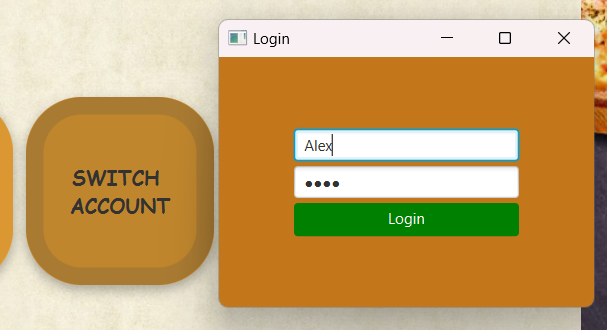
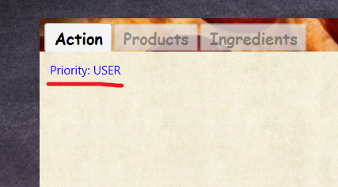
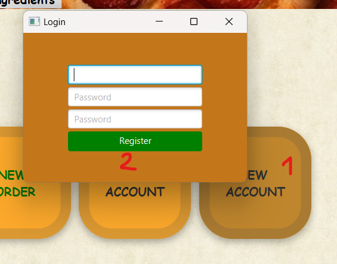
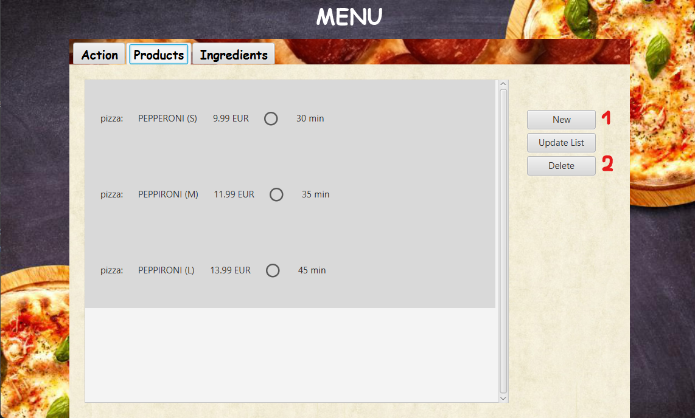
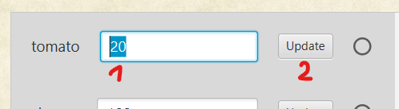
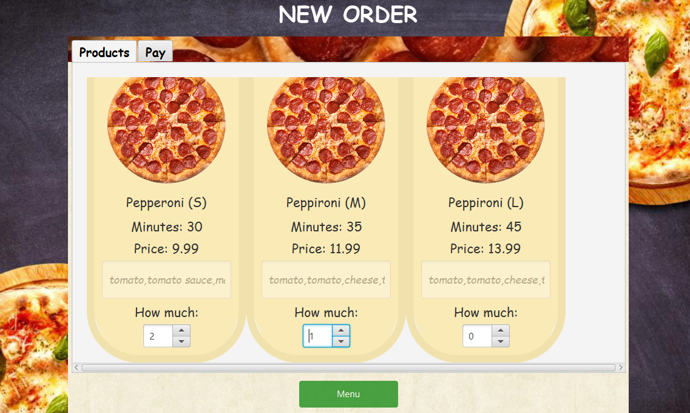

# Cash Register Emulator

*[English](README.md) ∙ [Latviešu](README.lv.md) ∙ [Русский](README.ru.md)*

### Kases aparāta emulators!

## Mērķi
- [x] Datu bāze (DB)
- [x] Lietotāja saskarne (UI)
- [x] Rediģējams produktu saraksts

---

## Instrukcijas

### Pieteikšanās sistēmā
Izmantojiet esošo kontu, piemēram: **(lietotājvārds: `admin`, parole: `admin`).

### Administratora prioritāte
Pēc pieteikšanās ar administratora kontu jums tiek piešķirtas administratora tiesības.

### Konta maiņa
Jūs varat mainīt savu kontu, piemēram, uz: **Alex** (lietotājvārds: `Alex`, parole: `root`) - šis konts ir bez administratora tiesībām.

### Lietotāja prioritāte
Ja esat pieteicies ar parasto kontu, jums ir lietotāja tiesības.

### Jaunu kontu izveide
Jūs varat izveidot jaunu kontu. Katram izveidotajam kontam būs lietotāja tiesības.

---

### Produktu pārvaldība

#### Produktu skatīšana un pārvaldīšana
Cilne "Produkti" ļauj apskatīt esošos produktus, izveidot jaunus produktus un dzēst produktus.

#### Produkta dzēšana
Šeit aprakstīts, kā dzēst izceltu produktu:

#### Jauna produkta izveide
Izpildiet norādījumus:
1. Sastāvdaļas uzskaitiet, izmantojot komatus. Piemēram: vistas gaļa, ābols, ābols, bumbieris, vistas gaļa (vistas gaļa: 2, ābols: 2, bumbieris: 1).
2. Pēc produkta informācijas aizpildīšanas noteikti saglabājiet izmaiņas!

---

### Sastāvdaļu pārvaldība

#### Sastāvdaļu skatīšana un pārvaldība
Cilnē "Ingredients" varat apskatīt esošo sastāvdaļu sarakstu, mainīt to daudzumu un dzēst.

#### Jaunas sastāvdaļas izveide
1. Ievadiet sastāvdaļas nosaukumu.
2. Norādiet daudzumu.
3. Noklikšķiniet uz “Izveidot jaunu sastāvdaļu” (1. un 2. laukam jābūt aizpildītiem).
4. Atjauniniet izmaiņas.

#### Sastāvdaļas dzēšana
Šeit ir aprakstīts, kā izdzēst sastāvdaļu:

#### Sastāvdaļas daudzuma maiņa
1. Ievadiet jaunu daudzumu.
2. Saglabājiet izmaiņas.

---

### Izrakstīšanās

Kad esat atjaunojis krājumus un izveidojis produktus, varat doties pie kases. Pievienojiet produktus grozam (0 - nav grozā).

### Produktu apmaksa
Produktu saraksts tiek parādīts augšpusē. Izvēloties produktu, varat skatīt detalizētu informāciju par produktu.

### Atlaižu karte
Jūs varat izmantot atlaižu karti, lai saņemtu 15% atlaidi no kopējās cenas.

### Maksājuma process
1. Atveriet lietotāja kartes emulatoru.
2. Nokopējiet kodu.
3. Ievietojiet kodu teksta lodziņā.
4. Noklikšķiniet uz pogas “Apstiprināt”.

5. Apstipriniet tulkojumu.

### Čeku izveide
Pēc veiksmīga maksājuma tiek izveidots jauns čeks. Čeks tiek saglabāts projekta mapē.

---

## Autori
- [AlexOsta](https://github.com/AlexUnderOS)