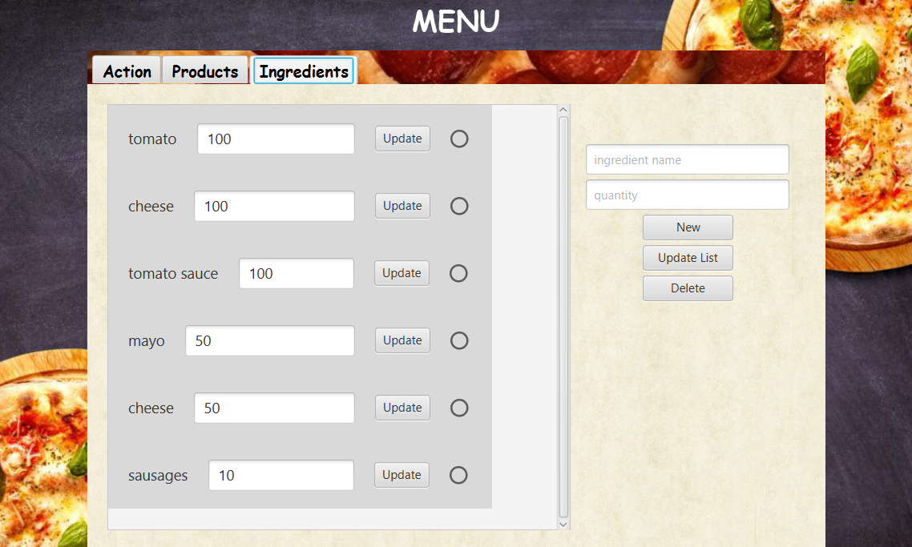
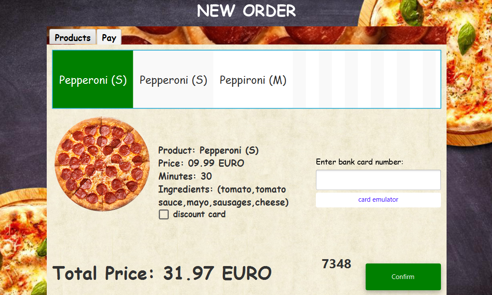

<<<<<<< HEAD
<<<<<<< HEAD
# Сash register for pizzerias
### A program that simulates a real cash register.

>> ## Goals
>> - [ ] database
>> - [ ] secure passwords
>> - [ ] completed UI
>> - [ ] added all products
>> - [ ] Depending on the product, the type for it is configured.
=======
# CASH REGISTER EMULATOR
### A program that simulates a real cash register.

>> ## Goals
>> - [X] DB
>> - [X] UI
>> - [X] Editable Product List

>>>>>>> feat/db
=======
# Cash Register Emulator

*[English](README.md) ∙ [Latviešu](README.lv.md) ∙ [Русский](README.ru.md)*

### A Cash Register Simulator

## Goals
- [x] Database (DB)
- [x] User Interface (UI)
- [x] Editable Product List

---

## Instructions

### Logging In
Use an existing account, for example: **admin** (login: `admin`, password: `admin`).

### Admin Privileges
When logged in with an administrator account, you will have admin privileges.

### Switching Accounts
You can switch accounts, for example to: **Alex** (login: `Alex`, password: `root`) — this account does not have admin privileges.

### User Privileges
When logged in with a regular account, you will have user privileges.

### Creating a New Account
You can create a new account. Each created account will have user privileges.

---

### Working with Products

#### Viewing and Managing Products
The "Products" tab allows you to view existing products, create new ones, and delete them.

#### Deleting a Product
Here is how to delete a selected product:

#### Creating a New Product
Follow the prompts:
1. List ingredients separated by commas. For example: chicken, apple, apple, pear, chicken (Chicken: 2, Apple: 2, Pear: 1).
2. Be sure to save changes after filling in the product information!

---

### Working with Ingredients

#### Viewing and Managing Ingredients
In the "Ingredients" tab, you can view the list of existing ingredients, change their quantities, and delete them.

#### Creating a New Ingredient
1. Enter the ingredient name.
2. Specify the quantity.
3. Click "Create New Ingredient" (fields 1 and 2 must be filled).
4. Save the changes.

#### Deleting an Ingredient
Here is how to delete an ingredient:

#### Changing Ingredient Quantity
1. Enter the new quantity.
2. Save the changes.

---

### Placing an Order

After restocking and creating products, you can proceed to place an order. Add products to the cart (0 - not in the cart).

### Paying for Products
The top section shows the list of products. By selecting a product, you can view detailed information about it.

### Discount Card
You can apply a discount card for 15% off the total price.

### Payment Process
1. Open the user card emulator.
2. Copy the code.
3. Paste the code into the text field.
4. Click the "Confirm" button.

5. Confirm the transfer.

### Creating a Receipt
After successful payment, a new receipt is created. The receipt is saved in the project folder.

---

## Authors
- [AlexOsta](https://github.com/AlexUnderOS)
>>>>>>> feat/receipts
