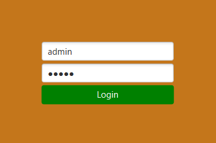
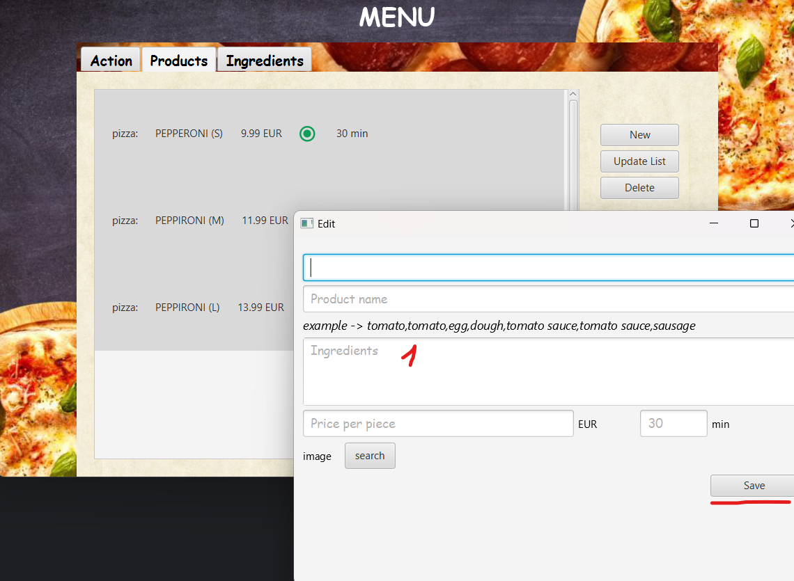

# Cash Register Emulator

*[English](README.md) ∙ [Latviešu](README.lv.md) ∙ [Русский](README.ru.md)*

### Симулятор кассогого аппарата

## Цели
- [x] База данных (DB)
- [x] Пользовательский интерфейс (UI)
- [x] Редактируемый список продуктов

---

## Инструкция

### Вход в систему
Используем существующий аккаунт, например: **admin** (логин: `admin`, пароль: `admin`).

### Приоритет Администратора
После входа под учетной записью администратора, вы получаете права администратора.

### Смена учетной записи
Вы можете сменить учетную запись, например на: **Alex** (логин: `Alex`, пароль: `root`) — эта учетная запись без прав администратора.

### Приоритет Пользователя
При входе под обычной учетной записью, вы имеете права пользователя.

### Создание нового аккаунта
Вы можете создать новый аккаунт. Каждый созданный аккаунт будет иметь права пользователя.

---

### Работа с продуктами

#### Просмотр и управление продуктами
Вкладка "Продукты" позволяет вам просматривать существующие продукты, создавать новые и удалять их.

#### Удаление продукта
Вот как удалить выделенный продукт:

#### Создание нового продукта
Следуйте подсказкам:
1. Перечислите ингредиенты через запятую. Например: курица, яблоко, яблоко, груша, курица (Курица: 2, Яблоко: 2, Груша: 1).
2. Обязательно сохраните изменения после заполнения информации о продукте!

---

### Работа с ингредиентами

#### Просмотр и управление ингредиентами
Во вкладке "Ингредиенты" можно просматривать список существующих ингредиентов, изменять их количество и удалять их.

#### Создание нового ингредиента
1. Введите имя ингредиента.
2. Укажите количество.
3. Нажмите "Создать новый ингредиент" (необходимо заполнить поля 1 и 2).
4. Обновите изменения.

#### Удаление ингредиента
Вот как удалить ингредиент:

#### Изменение количества ингредиента
1. Введите новое количество.
2. Сохраните изменения.

---

### Оформление заказа

После пополнения запасов и создания продуктов, можно приступить к оформлению заказа. Добавляем продукты в корзину (0 — не в корзине).

### Оплата продуктов
В верхней части показан список продуктов. Выбирая продукт, можно посмотреть подробную информацию о нем.

### Скидочная карта
Вы можете применить скидочную карту на 15% от общей стоимости.

### Процесс оплаты
1. Откройте эмулятор карты пользователя.
2. Скопируйте код.
3. Вставьте код в текстовое поле.
4. Нажмите кнопку "Confirm".

5. Подтвердите перевод.

### Создание чека
После успешной оплаты создается новый чек. Чек сохраняется в папке проекта.

---

## Авторы
- [AlexOsta](https://github.com/AlexUnderOS)